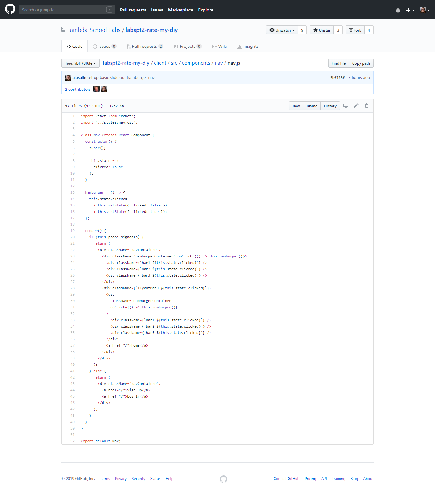
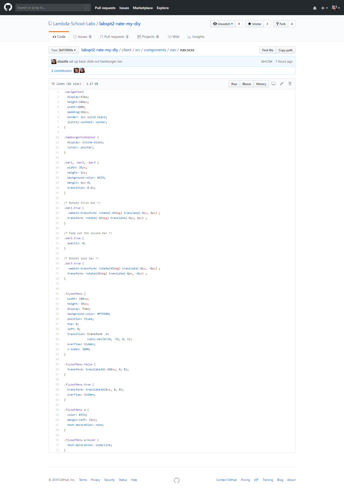

## Part 1 - Individual Accomplishments

project github: https://github.com/Lambda-School-Labs/labspt2-rate-my-diy/

github contribution graph: https://github.com/Lambda-School-Labs/labspt2-rate-my-diy/pulse

github handle: https://github.com/alasalle

Wow, these two weeks have been exciting. We have a lot of work ahead of us, but I feel like we're making solid progress. I spent much of the first work becoming more familiar with my team, helping to decide on the stack for our project, and researching the stack we decided on. Deciding on the stack was the main challenge of the first week; it was difficult to agree as a team on learning a completely new stack. 

The second week has been a little easier, though I feel that we're still tackling the learning curve of the new stack. After running into some shortcomings with Gatsby, I believe we've finalized our stack: React, Apollo Client, GraphQL, Prisma, and MongoDB. We really started to do the work needed to create our site. I helped set up the schema, mutations, resolvers, and I started working on the front end.  My main personal challenge this second week has been getting sick for the past 2 days. It really slowed me down. I'm pushing through it though, and I did manage to work on the navigation and resolvers a bit.

### Tasks Pulled

Most of the tasks I worked on this week were done as part of a the full team or a small group.

#### Front End

  - Ticket 1:
    - Github: https://github.com/Lambda-School-Labs/labspt2-rate-my-diy/commit/5bf178f6fefc45561993b16d58cb109d11efc8f7
    - Trello: https://trello.com/c/aiNnjVzA/43-components-nav

#### Back End
  - Ticket 1:
    - Github: https://github.com/Lambda-School-Labs/labspt2-rate-my-diy/commit/380cc93f47fc6eb07a2fc02a561a86f178abeb47
    -Trello: https://trello.com/c/bjizP7Jz/22-schema-define-schema-types
  
  - Ticket 2:
    - Github: https://github.com/Lambda-School-Labs/labspt2-rate-my-diy/commit/899e54f6d7f06ac37b0760999629a52dd5290d97
    - Trello: https://trello.com/c/aLtVYb0v/23-schema-define-query-type

  - Ticket 3:
    - Github: https://github.com/Lambda-School-Labs/labspt2-rate-my-diy/commit/5a70871a9d53d8b1858940cfc2af68419b84805f
    - Trello: https://trello.com/c/5F5FBPDk/24-create-a-resolver-to-return-some-data

###Detailed Analysis

I suppose the work I did for the navigation might warrant some analysis/explanation. It is very much a work in progress, and I'll complete the styling, routing, and any other necessary logic once we've collectively achieved a better idea for the look of our site. I chose to implement a hamburger menu/navigation that slides out horizontally to the right. I felt that this would eventually provide for an interesting effect/animation without needlessly cluttering up the rest of the page. I wanted to keep the animation in it's own space, if that makes sense. I've tackled basic animation/effects before, but I confess I've forgotten a bit over the course of our backend lessons. I chose to look through some tutorials on hamburger menus and navbar effects and make a few of them work together for me. I'm happy with the result for now.

## Part 2 - Milestone Reflections

### Weekly Question

My contribution to my team's TDD was the competitive landscape and features sections. Completing the features section was fairly simple once I became comfortable writing multiple user stories. I think that getting all of those features and user stories in a centralized place for everyone to see was very helpful in laying out the scope for the team.

My research for the competitive landscape portion was mainly through googling the features and topics that our project covered and going through the sites that came back. At first, my team wanted to stick to tech sector DIY, and so I was mainly looking into Dev.to and the relevant sections of Medium, but once we realized that we are required to cover all manner of DIY projects/ideas/communities, I started looking at other sites, like Pinterest.

