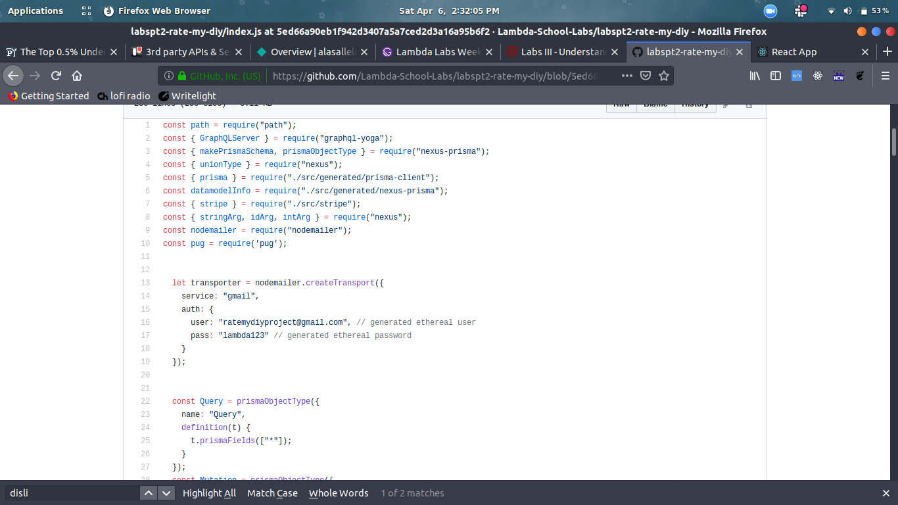
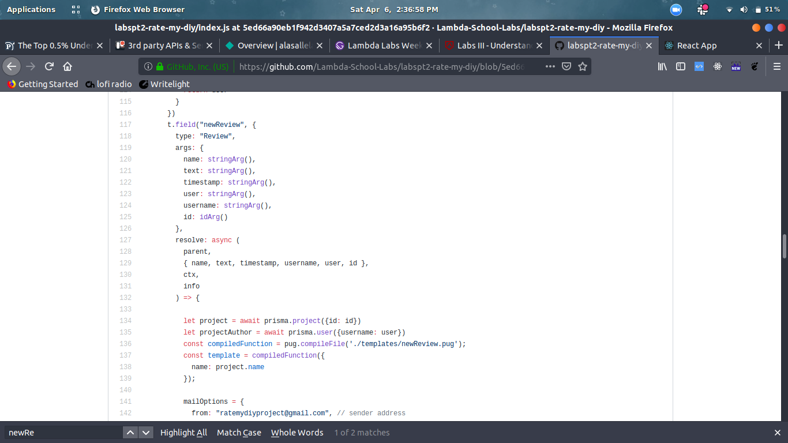
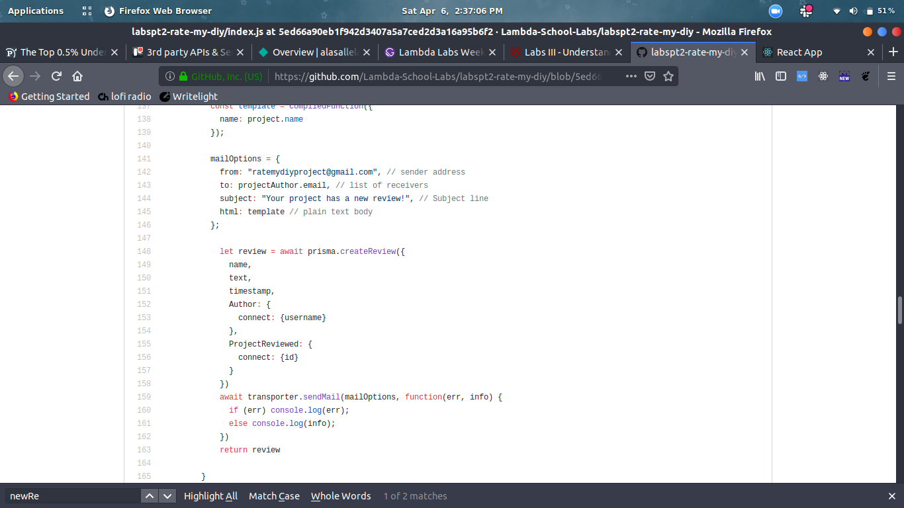
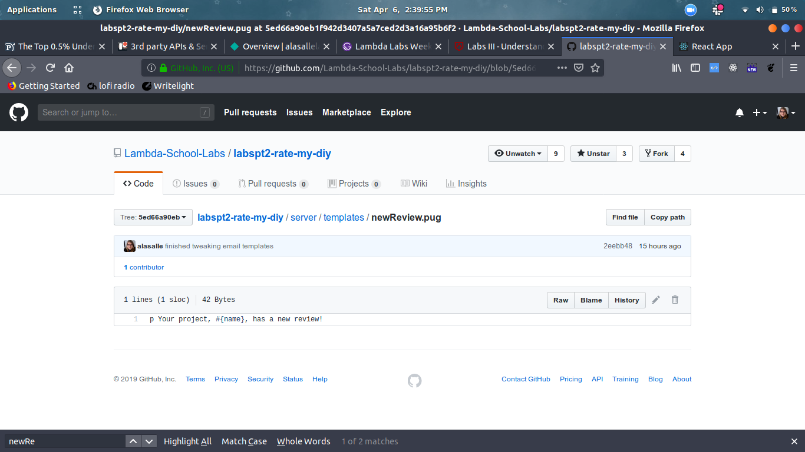
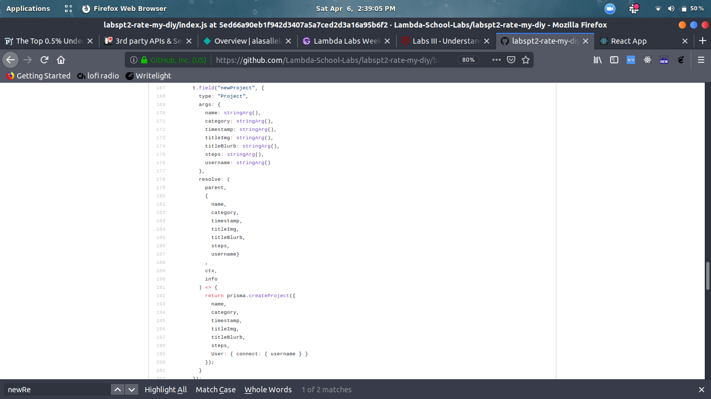
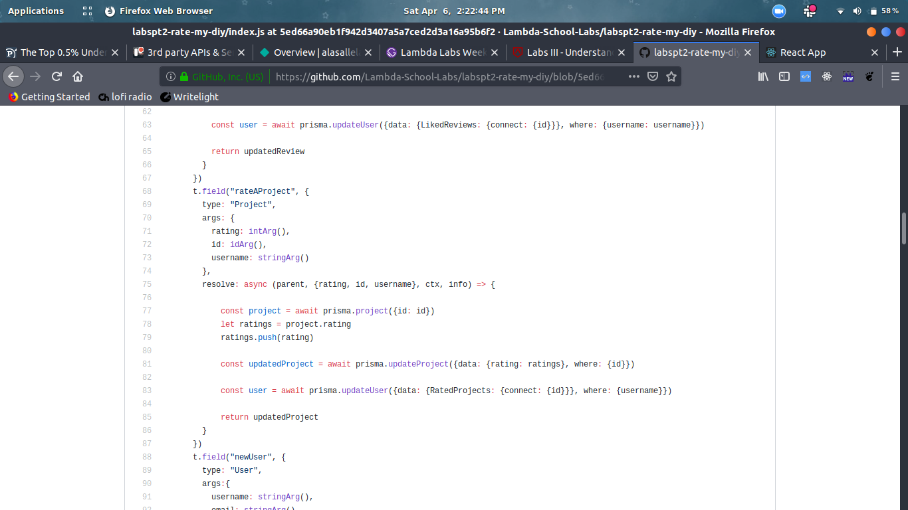

## Part 1 - Individual Accomplishments

project github: https://github.com/Lambda-School-Labs/labspt2-rate-my-diy/

github contribution graph: https://github.com/Lambda-School-Labs/labspt2-rate-my-diy/pulse

github handle: https://github.com/alasalle

During this sprint, I really put in the work on both the front end and the back end. I added basic components for the review list, project list, review card, project card, account page, settings page, and the navigation. I made it so that the review list and project list will render differently based on if the user is visiting their own or someone else's lists. I also made the navigation conditionally render based on if the user is signed in. I set up the search functionality in the Home page, the Searchbar, and the Search Page. I also set up cloudinary, so users can upload pictures, and nodemailer, so users are sent emails when they sign up and when one of their projects is reviewed. I helped my teammates work on allowing users to sign up through github. I helped set up firebase hosting. I also set up all necessary mutations for creating projects, creating reviews, creating users, rating projects, liking reviews, and disliking reviews.

### Tasks Pulled

#### Front End

  - Ticket 1:
    - Github: https://github.com/Lambda-School-Labs/labspt2-rate-my-diy/pull/35
    - Trello: https://trello.com/c/793T3XoM/11-review-list-page-empty

  - Ticket 2: 
    - Github: https://github.com/Lambda-School-Labs/labspt2-rate-my-diy/pull/32
    - Trello: https://trello.com/c/HUPxleJ1/5-search-page

  - Ticket 3:
    - Github: https://github.com/Lambda-School-Labs/labspt2-rate-my-diy/pull/33
    - Trello: https://trello.com/c/u5Yq7xEt/91-conditional-rendering-nav-sign-in

  - Ticket 4:
    - Github: https://github.com/Lambda-School-Labs/labspt2-rate-my-diy/pull/34
    - Trello: https://trello.com/c/A6tQilqv/17-settings-page

#### Back End

  - Ticket 1:
    - Github: https://github.com/Lambda-School-Labs/labspt2-rate-my-diy/pull/37
    - Trello: https://trello.com/c/KDZDxoGQ/10-create-edit-project-page

  - Ticket 2:
    - Github: https://github.com/Lambda-School-Labs/labspt2-rate-my-diy/pull/37
    - Trello: https://trello.com/c/uH4O66Lx/16-review-modal-window

  - Ticket 3:
    - Github: https://github.com/Lambda-School-Labs/labspt2-rate-my-diy/pull/37
    - Trello: https://trello.com/c/8Q9zkam5/8-project-list

  - Ticket 4:
    - Github: https://github.com/Lambda-School-Labs/labspt2-rate-my-diy/pull/37
    - Trello: https://trello.com/c/W03pWO8D/25-3rd-party-apis-service-integrations

###Detailed Analysis

The majority of my back end work is in github pull request 37. I completed 4 tickets with this pull request. I started this pull request by thinking about the best way to integrate the nodemailer functionality and talking it over with a team member. We ultimately agreed that putting the email functionality into two new mutations - newUser and newReview - along with the firebaseSignUp mutation would be the simplest and most efficient method.

I also decided to employ pug so we could make use of email templating.

After that, I realized we would need new mutations to provide user interactivity. I started with newProject. That was fairly straightforward, but I made sure to add the connect so the created project would be linked to its author.

I then added the rateProject mutation. I chose to separate this from the reviewProject mutation for cases when users do one but not the other. This one was only a hair trickier than newProject. I had to retrieve the project and its rating array, push the new rating, and then connect the rated project to the user that rated it.

Finally, I added the dislikeAReview and likeAReview mutations. These mutations required very similar steps as the newProject mutation. I had to retrieve the review and either its thumbsUp or thumbsDown value, add to the selected value, and then connect that like or dislike to the user who liked or disliked the review.

## Part 2 - Milestone Reflections

### Weekly Question

Scoping this sprint has been really tough. I've done far and away more work than was required and we're still behind schedule. Everyone has put in the work. I believe we'll catch up, but I feel like this sprint's objectives were more than 2 weeks worth of work. I do feel happy with what we've accomplished. The biggest challenge and time sink I encountered this sprint was the search bar and search page functionality. I still need to go back in and fix it again to only display results according to the options. We had so many issue with search it's hard to remember a lot of them. One of them was figuring out that we needed a composed apollo query component to get users, projects, and reviews from the database. Another was figuring out how to pass those results around. Filtering and conditionally diabling filter and sort buttons was a bit difficult. We solved these issues mainly through GoogleFu and talking to and pair programming with each other. That's been the answer to every challenge and bug we've faced so far.

