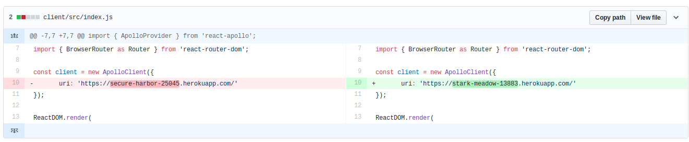
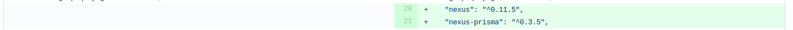
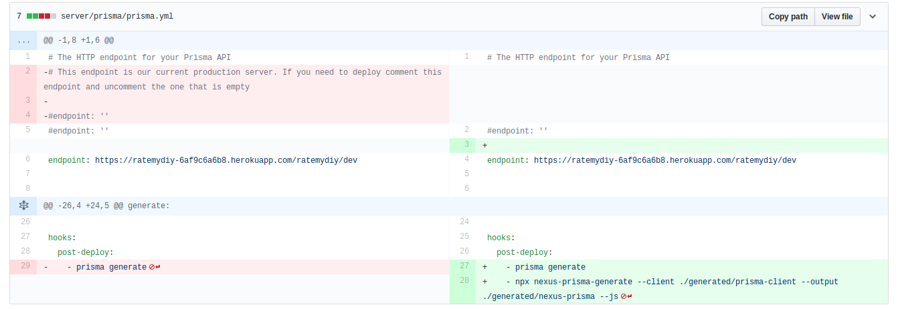
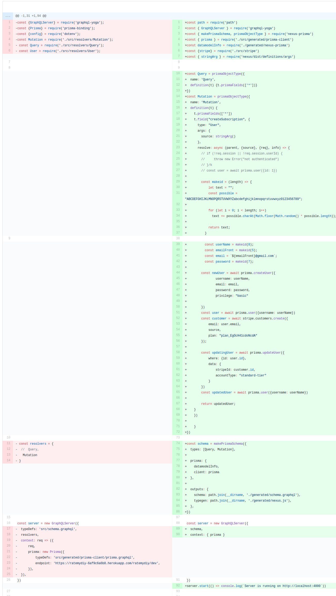

## Part 1 - Individual Accomplishments

project github: https://github.com/Lambda-School-Labs/labspt2-rate-my-diy/

github contribution graph: https://github.com/Lambda-School-Labs/labspt2-rate-my-diy/pulse

github handle: https://github.com/alasalle

The majority of my work during this sprint has been focused on making sure the backend will work for our intended purposes. The main challenge I faced was getting our server to provide us with working prisma mutations and queries alongside custom ones. I initially tried schema stitching and prisma binding, but replaced this with nexus-prisma, based on Julian's suggestion. That worked really well. Though, it looks like nexus doesn't yet support subscriptions, so we'll need to find a workaround for email subscriptions. I also implemented stripe.

### Tasks Pulled

As I mentioned above, the lion's share of my work has been on the back end for this sprint, but implementing stripe required some front end work.

#### Front End

  - Ticket 1:
    - Github: https://github.com/Lambda-School-Labs/labspt2-rate-my-diy/pull/17
    - Trello: https://trello.com/c/AmjwicxE/45-implement-stripe

#### Back End

  - Ticket 2:
    - Github: https://github.com/Lambda-School-Labs/labspt2-rate-my-diy/pull/22
    - Trello: https://trello.com/c/QGkDRfeY/59-nexus
  - Ticket 3:
    - Github: https://github.com/Lambda-School-Labs/labspt2-rate-my-diy/pull/26
    - Trello: https://trello.com/c/H1068N2f/61-seeding

###Detailed Analysis

My biggest accomplishment this sprint has to be getting the backend server set up the right way, and that was done with nexus-prisma. Thankfully, the process was relatively smooth.

I started by creating a new heroku app and inserting it into the client.

I then added the nexus and nexus-prisma dependencies.

Next, I added the nexus-prisma-generate post-deploy hook. Initially, I did not add the --js option and tried working with typescript (nexus defaults to typescript). I'm interested in typescript, but I couldn't get it immediately working and did not want to waste any more time, so I made it generate javascript files.

I then set up the index page using the nexus-prisma format. I honestly couldn't believe how easy it was. Even the custom mutation I wrote for stripe was nearly copy and paste levels of easy. Once I figured out how to use arguments with nexus, it was smooth sailing.

Next, I ran prisma deploy (which also ran prisma generate and nexus-prisma-generate).

Finally, I deleted the unnecessary resolvers folders.

## Part 2 - Milestone Reflections

### Weekly Question

Team formation has been fairly smooth these past two weeks. We've sadly lost two members due to personal reasons, but communication between the four of us remaining is solid. I feel like my greatest contribution to team solidification has mainly been putting in the work necessary to push us to each new level (even when I'm tired, busy, etc.). As for anything that might create friction - I have a slight tendency to want to go dark when I'm really in the zone. It's sometimes difficult to respond to an @ or dm when I feel like I'm moments away from getting something difficult done. I do make sure to follow up in some way, but still... I try to remain open to other opinions and options during decision making; for the most part, I'm receptive and am not going to dig my heels in. I think this helps allow for the space for others to contribute to team decision making.

